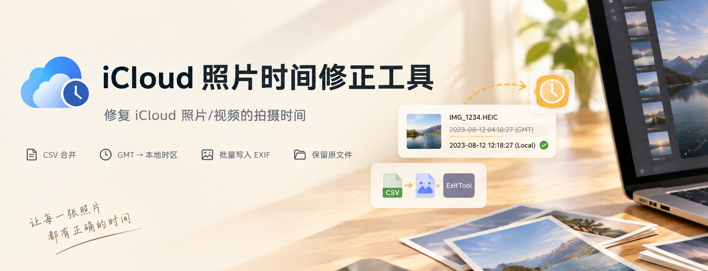
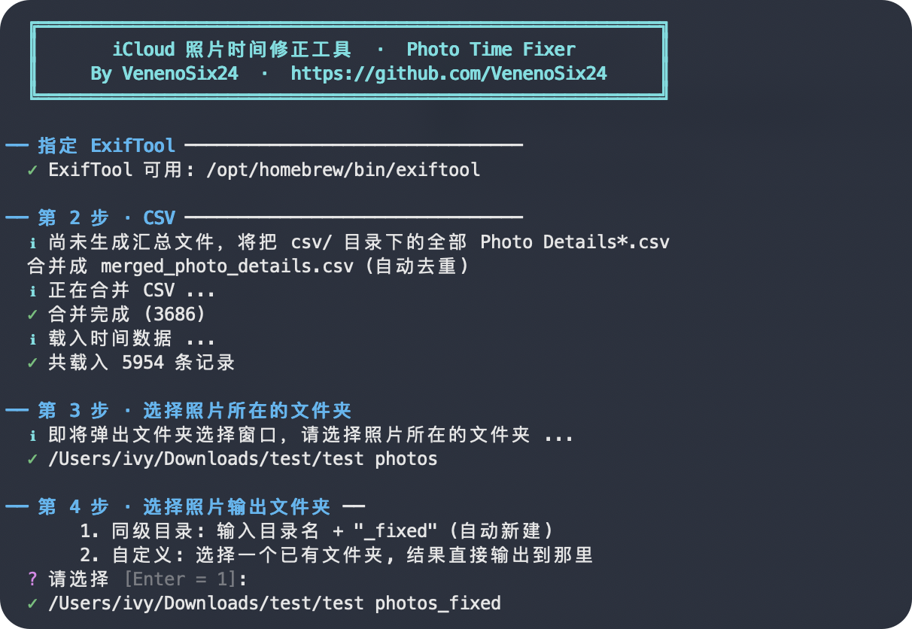
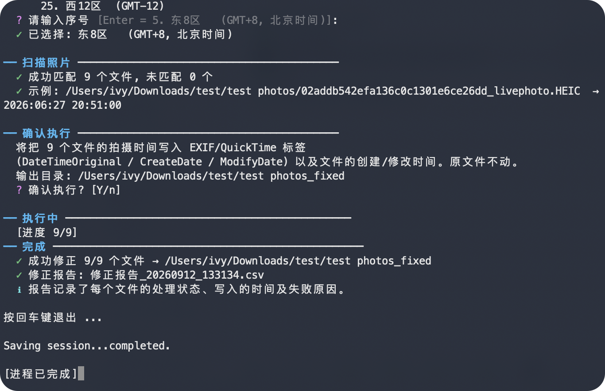

# iCloud 照片时间修正工具



[](https://github.com/VenenoSix24/icloud-photo-time-fix/actions/workflows/build.yml)
[](LICENSE)


[English](README_EN.md) | [简体中文](README.md)

从 iCloud 下载的部分照片没有 EXIF 拍摄时间，但 iCloud 会导出 **Photo Details CSV**。本工具读取 CSV，通过 [ExifTool](https://exiftool.org/) 把照片/视频的拍摄时间批量写回 EXIF/QuickTime 标签及文件时间戳。

## 预览

<table>
  <tr>
    <td width="50%" align="center"></td>
    <td width="50%" align="center"></td>
  </tr>
</table>

## 功能

- 图形窗口选择输入/输出目录，原文件不会被修改
- 自动合并多份 Photo Details CSV 并按文件名匹配照片
- GMT → 本地时区转换
- 递归扫描子文件夹，保留目录结构
- ExifTool CSV 批量写入，速度快；支持照片和视频
- 每次运行在输出目录生成修正报告 CSV

## 使用

需要 [Python 3.8+](https://www.python.org/) 和 [ExifTool](https://exiftool.org/)。

```bash
# 1. 把从 iCloud 导出的 Photo Details*.csv 放入 csv/ 文件夹
# 2. 安装 ExifTool: brew install exiftool，或解压放入 exiftool/ 文件夹
# 3. 运行
python fix_photo_time.py        # 中文
python fix_photo_time.py en     # English
```

按提示选择目录和时区即可。也可以运行 `python fix_photo_time.py --merge` 单独合并 CSV。

不想装 Python？可执行文件在 [Releases](https://github.com/VenenoSix24/icloud-photo-time-fix/releases) 下载，但同样需要 `csv/` 文件夹；ExifTool 可装在系统里（如 macOS 上 `brew install exiftool`），程序会自动查找，找不到时再使用 `exiftool/` 文件夹或手动指定。

### macOS 首次运行

下载的可执行文件没有签名，首次运行需要解除隔离并赋予执行权限，打开终端：

```bash
# 输入 /xxx 前方的命令，注意有空格，然后将下载的文件拖过去即可
xattr -dr com.apple.quarantine /xxx/icloud-photo-time-fix-macos-latest-zh
chmod +x /xxx/icloud-photo-time-fix-macos-latest-zh
```

执行后双击打开即可。

## 目录结构

```
├── fix_photo_time.py     # 主程序入口
├── icloud_ptf/           # 主程序模块 (界面/合并/时间解析/ExifTool 等)
├── csv/                  # 放 iCloud 导出的 Photo Details CSV
├── exiftool/             # 放 ExifTool 可执行文件
└── .github/workflows/    # 打包 CI
```

## License

[MIT](https://github.com/VenenoSix24/icloud-photo-time-fix?tab=MIT-1-ov-file)
